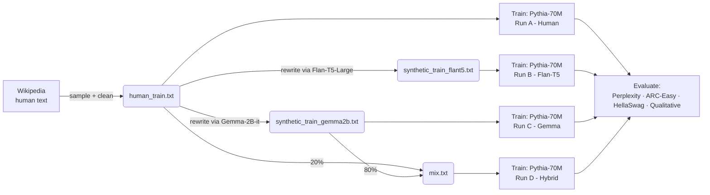

# Human, Synthetic, or Both? Evaluating Training Data Choices for Small Language Models

A controlled study of how training data source — human-written, synthetic (LLM-generated), or a hybrid mix — affects a small language model's language modeling quality and reasoning ability.

**TL;DR:** I fine-tuned four identical Pythia-70M models, changing only the training data. Human-written Wikipedia text gives the best perplexity (60.4), but synthetic data from Gemma-2B **boosts ARC-Easy reasoning accuracy more than 6x, from 4% to 26%**. Mixing in just 20% human data into the synthetic set recovers most of the perplexity loss while keeping the reasoning gains — the best of both worlds.

[📄 Read the full paper](paper/human_synthetic_or_both.pdf) · [📊 Jump to results](#results)

---

## Why this matters

Most synthetic-data research targets billion-parameter LLMs. This project asks the same question at a scale anyone can reproduce on a free Colab GPU: **does synthetic data still help when the model only has 70M parameters and a few hours of compute?**

## Pipeline



All four runs use the same base checkpoint, hyperparameters, and random seed — the only variable is the training data.

## Results

### Language modeling (held-out Wikipedia perplexity)

| Training Data | Eval Loss | Perplexity |
|---|---:|---:|
| Human (Wikipedia) | 4.1014 | **60.42** |
| Synthetic (Flan-T5) | 4.2705 | 71.56 |
| Synthetic (Gemma-2B) | 4.4061 | 81.95 |
| 20% Human / 80% Gemma | 4.2351 | 69.60 |

### Reasoning (ARC-Easy, 50-question subset)

| Training Data | Accuracy |
|---|---:|
| Human (Wikipedia) | 0.04 |
| Synthetic (Flan-T5) | 0.08 |
| Synthetic (Gemma-2B) | **0.26** |
| 20% Human / 80% Gemma | **0.26** |

### Commonsense reasoning (HellaSwag, 50-example subset)

| Training Data | Accuracy |
|---|---:|
| Human (Wikipedia) | 0.10 |
| Synthetic (Flan-T5) | 0.10 |
| Synthetic (Gemma-2B) | 0.12 |
| 20% Human / 80% Gemma | **0.18** |

**Takeaway:** synthetic data from a strong generator (Gemma-2B) trades language-modeling fidelity for reasoning ability, and a small amount of human data added back in closes most of that gap without giving up the reasoning gains. Perplexity alone underestimates what synthetic data is doing — it has to be paired with task-level evals to see the full picture.

### Qualitative example

Same prompt, four models, greedy decoding:

> **Context:** *He was born in Aschaffenburg, Bavaria and educated in medicine at the universities of Munich, Berlin, and Strasbourg, where he received his doctorate in 1908. During the following year, he began clinical work under the psychiatrist Emil Kraepelin...*

| Model | Continuation |
|---|---|
| Human-trained | *"He was also a doctoral student at the University of Munich, where he studied medicine and applied for a doctorate in medicine. He was also a doctoral student..."* (repetitive) |
| Flan-T5 synthetic | *"He was also a student at the University of Munich where he studied medicine. He was also a student..."* (repetitive) |
| **Gemma synthetic** | *"The following year, Kraepelin and his colleagues became central figures in early Alzheimer's disease research, helping establish the field of neuropathology..."* (fluent, but not fully grounded in the source) |

More examples and full discussion are in [the paper](paper/human_synthetic_or_both.pdf).

## Repository structure

```
.
├── src/
│   ├── data/
│   │   ├── load_human_data.py       # sample + clean Wikipedia paragraphs
│   │   ├── generate_synthetic.py    # rewrite paragraphs via Flan-T5 or Gemma-2B
│   │   └── mix_datasets.py          # build the human/synthetic hybrid set
│   ├── train.py                     # fine-tune Pythia-70M (CLM objective)
│   └── evaluate/
│       ├── common.py                # shared model loading / generation helpers
│       ├── eval_perplexity.py       # Table 1
│       ├── eval_arc_easy.py         # Table 2
│       ├── eval_hellaswag.py        # Table 3
│       └── eval_qualitative.py      # side-by-side continuations
├── results/                         # raw metric CSVs backing the tables above
├── notebooks/                       # end-to-end Colab-style walkthrough
├── paper/                           # full write-up (PDF)
└── requirements.txt
```

## Setup

```bash
git clone https://github.com/<your-username>/<your-repo>.git
cd <your-repo>
pip install -r requirements.txt
```

Generating Gemma-2B data requires a Hugging Face account with access to the gated `google/gemma-2b-it` weights:

```bash
huggingface-cli login
```

## Reproducing the results

```bash
# 1. Build the human-written dataset
python src/data/load_human_data.py --max_paragraphs 12000 --out_dir data

# 2. Generate synthetic rewrites
python src/data/generate_synthetic.py --style flan-t5 --model google/flan-t5-large \
    --in_file data/human_train.txt --out_file data/synthetic_train_flant5.txt

python src/data/generate_synthetic.py --style gemma --model google/gemma-2b-it \
    --in_file data/human_train.txt --out_file data/synthetic_train_gemma2b.txt

# 3. Build the hybrid set (20% human / 80% Gemma)
python src/data/mix_datasets.py \
    --human_file data/human_train.txt \
    --synthetic_file data/synthetic_train_gemma2b.txt \
    --human_fraction 0.2 --out_file data/mix.txt

# 4. Train all four models (repeat with each train_file / out_dir)
python src/train.py --train_file data/human_train.txt --eval_file data/human_val.txt --out_dir runs/human-70m
python src/train.py --train_file data/synthetic_train_flant5.txt --eval_file data/human_val.txt --out_dir runs/synthetic-70m-flan
python src/train.py --train_file data/synthetic_train_gemma2b.txt --eval_file data/human_val.txt --out_dir runs/synthetic-70m
python src/train.py --train_file data/mix.txt --eval_file data/human_val.txt --out_dir runs/mix-70m

# 5. Evaluate
python src/evaluate/eval_perplexity.py
python src/evaluate/eval_arc_easy.py
python src/evaluate/eval_hellaswag.py
python src/evaluate/eval_qualitative.py
```

A guided, cell-by-cell version of the same pipeline (built/tested on a Colab A100) is in [`notebooks/`](notebooks/).

## Method summary

- **Base model:** [Pythia-70M](https://huggingface.co/EleutherAI/pythia-70m), fine-tuned (not pretrained from scratch) for ~2 epochs per run.
- **Human data:** 12,000 paragraphs sampled from the Wikipedia (`20231101.en`) dataset, length-filtered (10-500 tokens) and MinHash-deduplicated.
- **Synthetic data:** every human paragraph rewritten by two open-source generators — Flan-T5-Large (lighter rewrite) and Gemma-2B-it (more elaborative rewrite) — using the `transformers` pipeline on a Colab GPU.
- **Hybrid data:** 20% human paragraphs + 80% Gemma-rewritten paragraphs, shuffled.
- **Evaluation:** held-out Wikipedia perplexity, 50-question subsets of ARC-Easy and HellaSwag, and qualitative continuation comparisons.
- **Compute:** Google Colab Pro (T4/A100), ~5-6 days total across all four runs.

## Limitations

- Single model scale (70M params) — results may not transfer to larger or instruction-tuned models.
- Evaluation is Wikipedia-style text, which structurally favors the human-trained model on perplexity.
- ARC-Easy/HellaSwag subsets are small (50 questions each), so accuracy differences should be read as directional rather than tightly bounded.
- Synthetic data quality is generator- and prompt-dependent; a different rewrite prompt or generator could shift these numbers.

## Citation

If you reference this work, please cite:

```bibtex
@misc{khan2025humansynthetic,
  author = {Khan, Tasin Tayeba},
  title  = {Human, Synthetic, or Both? Evaluating Training Data Choices for Small Language Models},
  year   = {2025}, % update if this was written/submitted in a different year
  note   = {University of Rochester}
}
```

## License

Code in this repository is released under the [MIT License](LICENSE). The paper text and figures are the author's own work.
